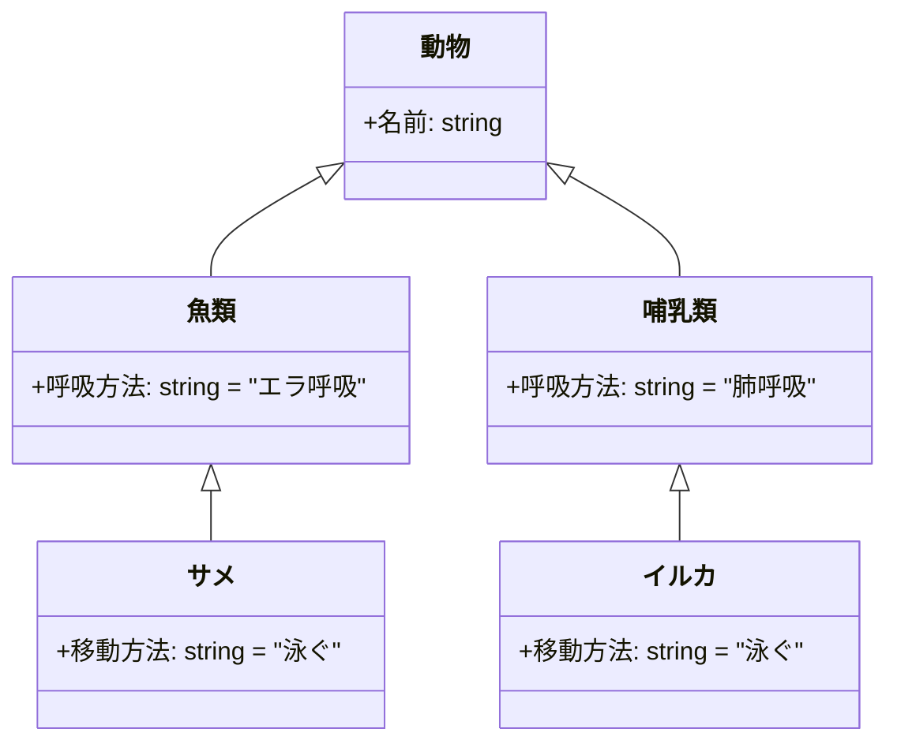
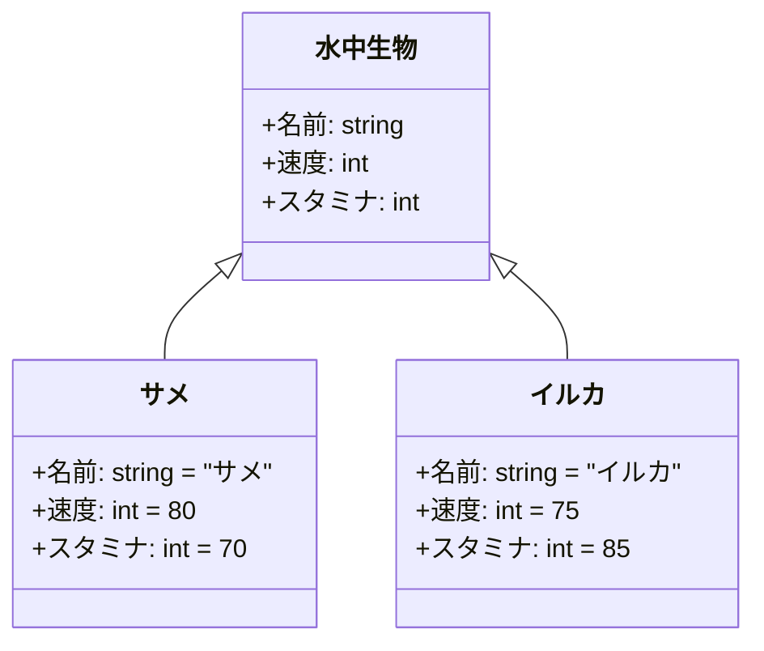
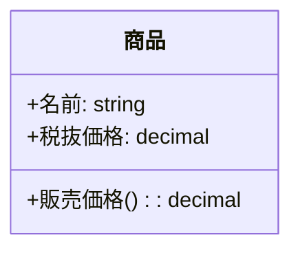
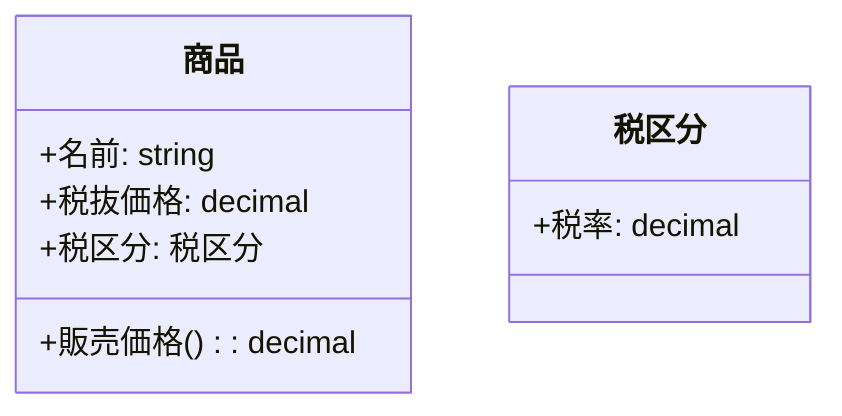

ソフトウェア設計に関わったことのある人であれば、「データ設計」が設計における重要な要素の一つであることに異論はないだろう。  
なお本記事で言う「データ設計」は、DBのテーブル設計に限らない。ビジネス上の概念をどう整理し、境界を引くか（ドメインモデリング）も含めた意味で用いる。

この記事で一番伝えたいことはシンプルだ。

**共通化はコードのテクニックではなく、データ設計（＝どの概念を同一視し、どこで分離するか）の判断である。**  
そして、**抽象化は本質的に難しく、時間がかかる**。だからこそ「急いで一つにまとめる」以外の選択肢を持とう、という話をする。

## tl;dr

- 共通化はコードのテクニックではなく、データ設計（どの概念を同一視するか）の判断である  
- コードの「見た目の重複」だけで共通化すると、将来の変更で破綻しやすい  
- 抽象化は本質的に難しく、前提の変化によって正解が変わることもある  
- 抽象化とは「何が不変で、何が可変か」を見極める行為である  
- 迷ったら重複を許容する（Avoid Hasty Abstraction / Three Strikes Rule）  
- 迷ったら、一旦立ち止まり「本当に同じ概念か？」を問い直す  

## 1. コードの「見た目」に惑わされない

まず最も重要であり、かつ陥りやすい罠は、「記述としてのコード」そのものに着目してしまうことである。

コードとは、ドメイン分析やデータ設計を通じて整理された「概念」を、ソフトウェアという言語で書き下した最終的な出力に過ぎない。したがって、コード上でどれほど似た記述を発見したとしても、それが直ちに共通化の対象になるとは限らない。

例えば、サメとイルカを想像してほしい。どちらも「水中で高速移動する」という生存戦略をとっているため、その振る舞いをコード化すれば、一見すると非常によく似たロジックが並ぶだろう。しかし、これらを「同じもの」として共通化してしまうと、設計はすぐに破綻する可能性が高い。なぜなら、両者の意味論（セマンティクス）が根本から異なるからである。

サメは魚類であり、イルカは哺乳類である。例えば「呼吸」という処理を実装する場合、サメにはエラ呼吸のロジックが必要だが、イルカには水面での肺呼吸という全く別のロジックが求められる。もし無理に共通化していれば、共通化の中心（ベースクラスや共通関数）の中は呼吸法を切り分けるための if 分岐であふれ、変更のたびに破綻しやすくなる。

ここで強調しておきたいのは次の点だ。

> 「コードが重複している」という状態は、設計の不備ではなく、  
> 「まだ共通化すべき概念が十分に成熟していない」というシグナルに過ぎない場合がある。

つまり、「現状のコードの見た目」だけに囚われると、その背後にある「概念の由来」や「変化の理由」を踏まえた思考ができなくなる。抽象化・共通化に立ち向かうときは、コードという現象の背後にある、構造化された「意味」に着目すべきである。

## 2. データ設計は「どこを共通化し、どこを分離するか」を決める

本記事の冒頭で、「データ設計」とは現実世界の概念をシステム上で扱える形に再構成する作業であると書いた。これは一般に「データモデリング」と呼ばれる。

データモデリングとは、どのようなエンティティが存在し、それぞれがどのような属性を持つかを整理し、さらにエンティティ間の関係性を定義する作業である。言い換えると、**似ているものを同一視する（共通化する）のか、別物として分離するのか**を決める作業でもある。

同じ「サメ」と「イルカ」を扱っていても、作るシステム次第で妥当な設計は変わる。ここでは2つの例を用いて考えてみる。

### A: 研究所向け生物シミュレーションシステム

（私は関わったことはないが）生物シミュレーションシステムにおいては、生物分類に基づいてデータ設計を行うことは有力な選択肢の一つになるだろう。その場合、データモデルは次のようになるかもしれない。

### B: 水中生物レースゲーム

一方、水中生物レースゲームであれば、「どの速度で泳ぐか」を扱えれば十分かもしれない。その場合、データモデルは次のようになるだろう。

このように、同じサメとイルカを扱っていても、どのようなシステムを作るかによってデータ設計の結果は変わる。そして、どこを共通化するかも変わる。

Aでは生物分類単位で共通部分を切り出すのが妥当になりやすい。一方Bでは「水中生物」という単位で共通化するのが自然である。

## 3. 抽象化は難しい（そして壊れうる）ことを前提にする

抽象化は、いつでも簡単に正解が得られる類のものではない。少し視野を広げると、我々が当たり前に使っている概念ですら成立までに長い時間がかかっている。

例えば、「数える」という行為は古くから存在したはずだが、「数」という概念を一般化し体系化するには長い時間が必要だった。また負の数のように、直感に反する概念が広く受け入れられるまでにも時間がかかったと言われている。(参考: [数学の年表](https://ja.wikipedia.org/wiki/%E6%95%B0%E5%AD%A6%E3%81%AE%E5%B9%B4%E8%A1%A8))

ここから得られる教訓はこうだ。

- 抽象化は本質的に難しい
- 「真に共通化できるもの」が見えるまでには時間がかかることがある
- その間にコードの重複が発生するのは、ある程度は自然である

そしてソフトウェアでは、さらに難しくなる要因がある。それが「前提が変わる」ことだ。

### 3.1 変化する前提が抽象化を壊す

例えば、商品の販売価格を管理するシステムがあり、税率が一律である前提で設計すると次のような形になるかもしれない。

この時点では、`販売価格()` を「税抜価格 × 1.10」のように共通実装したくなる。

しかし軽減税率の導入のように、将来「商品種別ごとに税率が異なる」前提に変わると、単純な共通実装は破綻する。

ここで重要なのは、「食品は1.08、家電は1.10」のように *クラスに税率を焼き付ける* ことではなく、**税率が“変わりうるルール”である**と捉えて設計上の居場所を分離することだ（期間や国によって変動する可能性もある）。

さらに踏み込むなら、次の視点が抽象化の核になる。

- 税率という「数値」は可変である
- 税額を計算するという「ルール（計算が存在すること）」は不変に近い

抽象化とは、この「不変」と「可変」の境界線を見極める作業である。  
そして将来の前提変更は、その境界線をずらし得る。これが抽象化を難しくする最大の理由だと私は考えている。

## 4. どうやって抽象化に取り組むか

とはいえ、抽象化を諦めれば、コードは重複だらけのまま増え続け、最終的にはメンテナンスが難しくなる。よって我々は現実的な範囲で抽象化に取り組む必要がある。

私が有効だと考えている方法は、以下の2つである。

- 製品のコンセプトを明確にし、将来の発展の可能性を幅広く想定する
- 類似事例を徹底的に調査する

### 4.1 製品のコンセプトを明確にし、将来の発展の可能性を幅広く想定する

抽象化を検討する際、最も重要なのは、製品のコンセプトである。

例えば、「全ての商品の税額を管理して全社の業務を効率化するシステム」がコンセプトなのであれば、

- 全社で扱う商品に耐える汎用性
- 年単位の運用を前提にした変更耐性（税法改正など）

が求められやすい。

税法がどう改正されるかを完全に予測することはできないが、「どんなパターンがあり得るか」は調査できる。各国・各地域の税制や過去の改正の傾向を見て、起こり得る変更の幅を把握した上で、「どの範囲までを要件として設計に含めるか」を決める必要がある。

一方で「とりあえず直近の自チームが扱う商品の税額を管理するシステム」がコンセプトであれば、

- 対象商品の範囲を限定した設計
- 直近の運用上の前提（例: 税率10%固定）に寄せた割り切り

も合理的になり得る。

このように、製品のコンセプトによって、データ設計は大きく変わり、その結果として抽象化の方向性も変わってくる。

### 4.2 類似事例を徹底的に調査する

抽象化は難しい。だからこそ、自分一人の経験や知見だけでベストに近い答えを導ける確率は高くない、と捉えるのが現実的だ。

そこで、類似のソフトウェアがどういうデータ設計を採用したのか、その理由を調査することをおすすめする。

- 既存プロダクトの設計思想
- 公開されている設計資料や事例
- OSSのモデル設計や議論（Issue/PR など）

こうした情報から「複数人が悩んだ過程」を取り込みつつ、自分のコンテキストに合わせて最終判断できる。結果として、1人で考えるより妥当な答えに辿り着ける可能性が上がると私は考えている。

## 5. 共通化できそうなコードを見つけたときにどうするべきか

実装者の立場からすると、明らかに同じコードを見つけると共通化したくなる気持ちは理解できる。こういうときは、以下を検討するのがおすすめだ。

- データ設計の観点から、この2つのコードが本質的に同じ概念なのかを自問する（レビューや第三者視点、議論、LLMとの壁打ちなどでもよい）
- 一旦共通化する場合でも、それが間違っていたときにすぐ解体できるように設計する（呼び出し側の依存を薄く保つ、境界を作るなど）

加えて、意思決定の「目安」を持っておくと迷いにくい。

- **迷ったら重複を許容する（Avoid Hasty Abstraction）**
- **同じものが3箇所に現れたら、そこで初めて共通化を検討する（Three Strikes Rule）**

共通化は「短く書ける」ことが価値ではない。  
共通化によって生まれる結合のコストが、将来どこまで効いてくるかを考える必要がある。

この記事の主張は「共通コードを見つけたら絶対に共通化するな」ではない。  
「共通化は“コード上の見た目”ではなく“概念の同一性”で判断しよう」というだけだ。

また、技術負債の大きな一因はデータ設計（ドメイン設計）の不備にあると私は考えている。だからこそ、"共通コード" を見つけたときにデータ設計に立ち戻る習慣があれば、負債の蓄積を緩和できる可能性がある。

## まとめ

- 共通化はコードのテクニックではなく、データ設計（概念の同一視と分離）の判断である
- 抽象化は難しく、前提変更によって将来「壊れる」ことがある
- 抽象化の核は「不変」と「可変」の境界線を見極めることにある
- 迷ったら重複を許容し、3箇所に現れたら共通化を検討するくらいがちょうどよい

共通コードを見つけたからといってすぐに共通関数を実装するのではなく、データ設計に立ち戻って考える、という選択肢もある。この記事がそのきっかけになれば嬉しい。

---

私がテックリードを務める [株式会社フライル](https://herp.careers/v1/flyle) では、現在ソフトウェアエンジニアを募集しています。  
この記事の内容に共感いただけた方、ここで述べた考え方を実務にどう取り入れているのか気になる方、また事業内容に興味のある方は、ぜひカジュアル面談でお話ししましょう。
