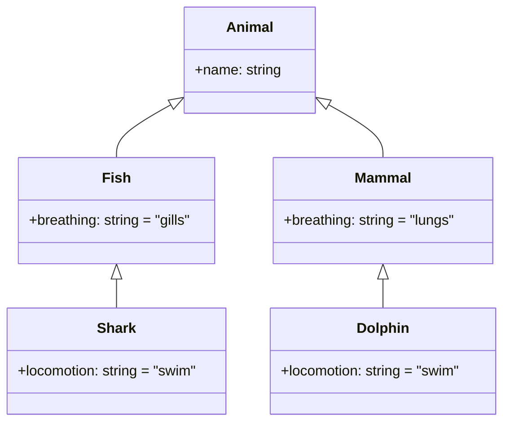
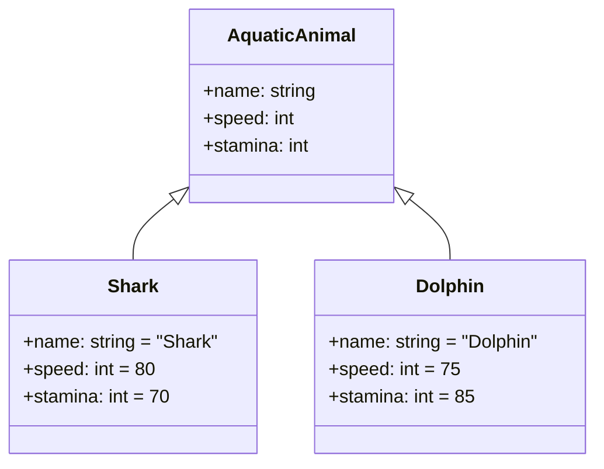
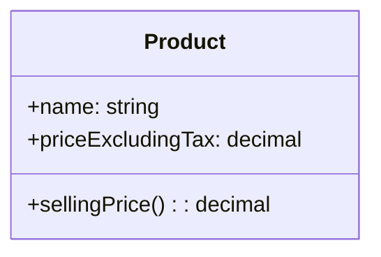
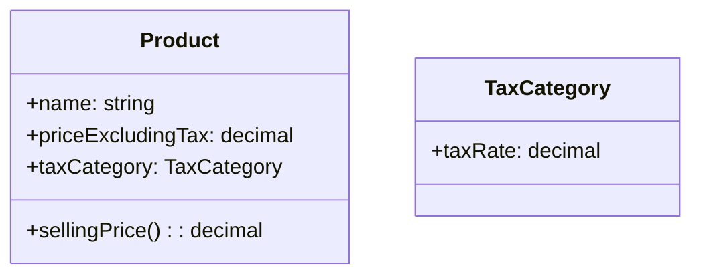

If you have ever been involved in software design, you will not disagree that "data design" is one of the important elements of design.  
Note that "data design" in this article is not limited to database table design. I use it in a sense that also covers how you organize business concepts and where you draw boundaries (domain modeling).

What I most want to convey in this article is simple.

**Consolidation is not a coding technique; it is a data-design decision (i.e., which concepts you treat as the same, and where you separate them).**  
And **abstraction is inherently hard and takes time**. That is exactly why we should have options other than "hurry up and merge everything into one."

## tl;dr

- Consolidation is not a coding technique; it is a data-design decision (which concepts you treat as the same)  
- Consolidating based only on "surface-level duplication" in the code tends to break down under future changes  
- Abstraction is inherently hard, and the right answer can change as premises change  
- Abstraction is the act of determining what is invariant and what is variable  
- When in doubt, tolerate duplication (Avoid Hasty Abstraction / Three Strikes Rule)  
- When in doubt, stop and ask again: "are these really the same concept?"  

## 1. Do not be fooled by the "look" of the code

The most important trap, and the easiest one to fall into, is focusing on "code as written text" itself.

Code is nothing more than the final output of writing down, in the language of software, the "concepts" that were organized through domain analysis and data design. So no matter how similar two pieces of code look, that alone does not make them candidates for consolidation.

For example, picture a shark and a dolphin. Both adopt the survival strategy of "moving fast underwater," so if you write that behavior as code, you will end up with logic that looks very similar at first glance. But if you consolidate them as "the same thing," the design is likely to break down quickly, because their semantics differ fundamentally.

A shark is a fish; a dolphin is a mammal. If you implement a "breathing" operation, for example, a shark needs gill-breathing logic, while a dolphin requires entirely different logic: lung breathing at the surface. If you had forced them together, the center of the consolidation (the base class or shared function) would fill up with `if` branches to split the breathing methods, and it would break easily with every change.

The point I want to emphasize here is this.

> The state of "the code is duplicated" is not necessarily a design flaw; sometimes it is  
> merely a signal that "the concept to be consolidated has not matured enough yet."

In other words, if you are captured by "how the current code looks," you lose the ability to think in terms of the "origin of the concept" and the "reasons for change" behind it. When you take on abstraction and consolidation, you should focus on the structured "meaning" behind the phenomenon that is the code.

## 2. Data design decides "what to consolidate and where to separate"

At the beginning of this article, I wrote that "data design" is the work of restructuring real-world concepts into a form the system can handle. This is generally called data modeling.

Data modeling is the work of organizing which entities exist and what attributes each of them has, and then defining the relationships between entities. Put differently, it is also the work of deciding **whether to treat similar things as the same (consolidate them) or to separate them as distinct things**.

Even when you are dealing with the same "shark" and "dolphin," the reasonable design changes depending on the system you are building. Let us think about this with two examples.

### A: A biological simulation system for a research institute

(I have never worked on one, but) in a biological simulation system, doing data design based on biological classification would likely be one strong option. In that case, the data model might look like this.

### B: An underwater creature racing game

On the other hand, for an underwater creature racing game, being able to handle "how fast it swims" might be enough. In that case, the data model would look like this.

As you can see, even when you are dealing with the same shark and dolphin, the result of data design changes depending on what kind of system you are building. And what you consolidate changes along with it.

In A, it is likely reasonable to factor out the shared parts along the lines of biological classification. In B, consolidating at the level of "underwater creature" is the natural choice.

## 3. Assume that abstraction is hard (and can break)

Abstraction is not the kind of thing where you can always arrive at the right answer easily. If you widen your view a little, even the concepts we take for granted took a long time to be established.

For example, the act of "counting" must have existed since ancient times, but generalizing and systematizing the concept of "number" took a long time. It is also said that counterintuitive concepts such as negative numbers took time before they were widely accepted. (Reference: [Timeline of mathematics](https://en.wikipedia.org/wiki/Timeline_of_mathematics))

The lesson to draw from this is as follows.

- Abstraction is inherently hard
- It can take time before "what can truly be consolidated" becomes visible
- Duplication in the code arising in the meantime is, to some extent, natural

And in software, there is a factor that makes it even harder: premises change.

### 3.1 Changing premises break abstractions

For example, suppose there is a system that manages the selling price of products. If you design it on the premise that the tax rate is uniform, it might take the following shape.

At this point, you would be tempted to implement `sellingPrice()` as shared logic, something like "price before tax × 1.10."

But if the premise later changes to "the tax rate differs by product type," as with the introduction of a reduced tax rate, that simple shared implementation breaks down.

What matters here is not *baking the tax rate into the class*, as in "food is 1.08, appliances are 1.10," but rather treating **the tax rate as a "rule that can change"** and giving it its own place in the design (it may also vary by period or by country).

Going one step further, the following perspective is the core of abstraction.

- The "number" that is the tax rate is variable
- The "rule" of calculating the tax amount (the fact that a calculation exists) is close to invariant

Abstraction is the work of determining the boundary between this "invariant" and "variable."  
And future changes in premises can shift that boundary. I believe this is the biggest reason abstraction is hard.

## 4. How to take on abstraction

That said, if we give up on abstraction, the code will keep growing full of duplication, and it will eventually become hard to maintain. So we need to take on abstraction within a realistic scope.

There are two approaches I consider effective.

- Clarify the product concept, and consider a wide range of possible future developments
- Research similar cases thoroughly

### 4.1 Clarify the product concept, and consider a wide range of possible future developments

When considering abstraction, the most important thing is the product concept.

For example, if the concept is "a system that manages the tax amount of all products and streamlines company-wide operations," then

- generality that holds up across all products handled company-wide
- resilience to change on the premise of operation over years (tax law revisions, and so on)

are likely to be required.

You cannot fully predict how tax law will be revised, but you can research "what patterns are possible." You need to look at the tax systems of various countries and regions and the trends of past revisions, grasp the range of changes that could occur, and then decide "how much of that range to include in the design as requirements."

On the other hand, if the concept is "a system that, for now, manages the tax amount of the products my own team handles," then

- a design that limits the scope of target products
- pragmatic simplifications leaning on near-term operational premises (e.g., a fixed 10% tax rate)

can also be reasonable.

In this way, data design changes greatly depending on the product concept, and as a result the direction of abstraction changes too.

### 4.2 Research similar cases thoroughly

Abstraction is hard. That is exactly why it is realistic to assume that the probability of deriving a near-best answer from your own experience and knowledge alone is not high.

So I recommend researching what data designs similar software adopted, and why.

- The design philosophy of existing products
- Published design documents and case studies
- Model designs and discussions in OSS (issues, PRs, and so on)

From this kind of information, you can take in "the process by which multiple people wrestled with the problem" and still make the final call in a way that fits your own context. As a result, I believe your chances of reaching a sound answer are higher than thinking alone.

## 5. What to do when you find code that looks consolidatable

From an implementer's standpoint, I understand the urge to consolidate when you find code that is clearly the same. In such cases, I recommend considering the following.

- Ask yourself, from a data-design perspective, whether these two pieces of code are essentially the same concept (a review, an outside perspective, a discussion, or bouncing ideas off an LLM all work)
- Even if you do consolidate for now, design it so that you can dismantle it quickly if it turns out to be wrong (keep the callers' dependencies thin, create boundaries, and so on)

In addition, having "rules of thumb" for the decision makes it easier to avoid getting stuck.

- **When in doubt, tolerate duplication (Avoid Hasty Abstraction)**
- **Only once the same thing appears in three places should you start considering consolidation (Three Strikes Rule)**

The value of consolidation is not that it lets you write less.  
You need to think about how far the coupling cost created by consolidation will make itself felt in the future.

The claim of this article is not "never consolidate when you find shared code."  
It is simply "judge consolidation by conceptual identity, not by how the code looks."

I also believe that a major cause of technical debt lies in flaws in data design (domain design). That is exactly why, if you have the habit of going back to data design when you find "shared code," you may be able to slow the accumulation of debt.

## Summary

- Consolidation is not a coding technique; it is a data-design decision (treating concepts as the same, and separating them)
- Abstraction is hard, and it can "break" in the future when premises change
- The core of abstraction lies in determining the boundary between "invariant" and "variable"
- Tolerating duplication when in doubt, and considering consolidation once it appears in three places, is about the right balance

Rather than immediately implementing a shared function just because you found shared code, you also have the option of going back to data design and thinking it through. I would be glad if this article becomes an occasion for that.

---

At [flyle, Inc.](https://herp.careers/v1/flyle), where I serve as VP of Technology, we are currently hiring software engineers.  
If this article resonated with you, if you are curious about how we bring these ideas into actual practice, or if you are interested in our business, let us talk in a casual interview.
